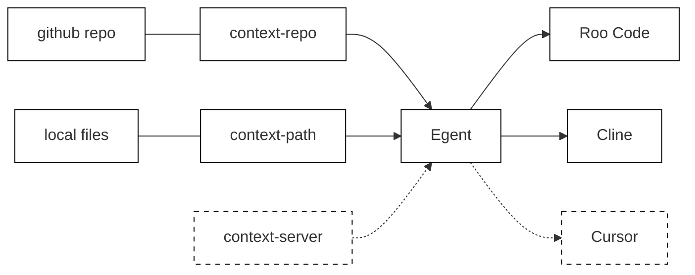

# Egent

Egent aims to be the platform that bridges **engineer teams** and **agents**.

## Table of Contents

- [Design](#design)
- [How to Use](#how-to-use)
  - [Supported Agents](#supported-agents)
  - [Configuration Examples](#configuration-examples)
- [Roadmap](#roadmap)

## Design



Egent supports two types of context:

- **`context-repo`**: A git repository containing context files. Ideal for team collaboration.
- **`context-path`**: A local directory containing context files. Perfect for personal development or testing.

Context contains two types of content:

- **`knowledge`**: Knowledge base for the agent to answer questions.
- **`task-templates`**: Task templates for the agent to complete tasks.

A task template can reference knowledge as a dependency. When an agent reads a task template, it will also load the referenced knowledge.

## How to Use

Egent converts `knowledge` and `task-templates` into MCP resources, making them available to compatible code agents.

### Supported Agents

The verified code agents that work with Egent:

- **Roo Code** (Claude 3.7 Sonnet)
- **Cline** (Claude 3.7 Sonnet)

### Configuration Examples

**Basic Configuration:**

To use Egent with a remote context repository:

```json
{
  "mcpServers": {
    "egent": {
      "command": "npx",
      "args": ["-y", "egent@latest", "--context-repo", "<your context repo>"]
    }
  }
}
```

An example context repo: [git@github.com:stolostron/server-foundation-dev-context.git](git@github.com:stolostron/server-foundation-dev-context.git)

**Local Development:**

For testing with a local context directory:

```json
{
  "mcpServers": {
    "egent-local": {
      "command": "npx",
      "args": [
        "-y",
        "egent@latest",
        "--context-path",
        "<your context files path>"
      ]
    }
  }
}
```

**Egent Development:**

For developing Egent itself:

```json
{
  "mcpServers": {
    "egent-dev": {
      "command": "node",
      "args": ["build/index.js", "--context-path", "<your context files path>"]
    }
  }
}
```

You can also use `inspector` to inspect the MCP resources:

```bash
npx @modelcontextprotocol/inspector node build/index.js --context-repo git@github.com:stolostron/server-foundation-dev-context.git
```

## Roadmap

- Add a hello workd context repo.
- Add GUI context server.
