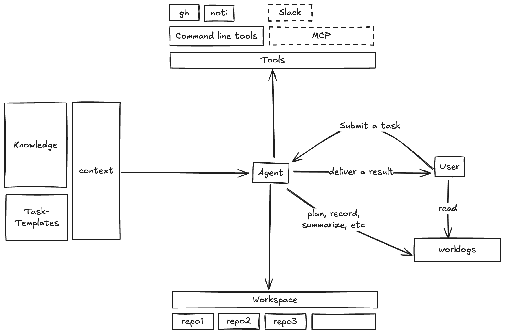

# Egent

Egent stands for "Engineer Agent," designed to take care of all the tedious and trivial tasks for you.

It now can handle:

- Tiny refactor a repo
- Upgrade the Hive API every train
- Bump up a dependency of a repo
- Upgrade the Go version of a repo

## Table of Contents

- [Demo](#demo)
- [How to use](#how-to-use)
  - [Workspace](#workspace)
  - [Context](#context)
  - [Tools](#tools)
- [FAQ](#faq)
  - [Why not just script it?](#why-not-just-script-it)
  - [When can it handle more complex tasks?](#when-can-it-handle-more-complex-tasks)
- [Key Mindset Shifts For Engineers](#key-mindset-shifts-for-engineers)
  - [Let AI do, you help](#let-ai-do-you-help)
  - [Start managing the "shadow knowledge"](#start-managing-the-shadow-knowledge)
- [Roadmap](#roadmap)

## Demo

## How to use

First, you need to set the right cursor settings:

- Cursor version: 0.47.x
- Enable `auto-run` mode.
- Review changes set to `Auto-run`.
- Model Preference: Thinking (claude-3.7-sonnet)

The agent works with the following components:

- #### Workspace:
  - Create the `/workspace` folder, and git clone all the repositories you want your agent to work on.
- #### Context:
  - Task-Templates: `/task-templates`
    - In professional settings, engineers typically receive brief task descriptions but can quickly transform them into detailed execution plans based on their **experience**.
    - Task templates aim to achieve this process: you only need to provide a brief task description, and the Agent will automatically **map it into a comprehensive execution plan**.
  - Knowledge: `/knowledge`
    - Add everything you want to use as context for the agent.
    - Particularly **shadow knowledge** - the implicit information experienced engineers possess. This includes repository architecture, PR submission workflows, team coding standards, and other tacit knowledge typically acquired through experience.
    - For adding **domain knowledge**, you can also leverage Cursor's [Docs feature](https://docs.cursor.com/context/@-symbols/@-docs), which allows you to seamlessly integrate external documentation and reference materials that your agent can access and utilize during tasks.
- #### Tools:
  - There are mainly **2** types of tools the agent can use: the **command line tools** and **MCPs**.
  - For examples:
    - I want the agent to create PRs, so I need to install [gh](https://cli.github.com/) in my machine.
    - I also want the agent to send notification to me when the task is done, so I install the [noti](https://github.com/variadico/noti) in my machine.
  - Cursor also have a good [MCP](https://modelcontextprotocol.io/introduction) support, you can also add MCP Servers in the Cursor's settings.

If you want to start a new task, make sure you are in the `Agent` mode, then:

1. Type `Follow @start.md`, this will tell the agent to consume the context first.
2. Type the task description, it could be a short sentence if there is a task template for it.
   - For examples: `Tiny refactor import-controller` or `Hive API Upgrade for train 27`.
   - It could also be very detailed if it's a new task that agent never done before.
3. The agent will use `current-task.md` to record the task plan, progress, result, and it's reflection.

## FAQ

### Why not just script it?

If you happen to be an expert in scripting languages and don't require readability, maintainability, or compatibility, you could certainly use scripts to accomplish tasks like `upgrading Go version`.

However, to complete another task shown in the Demo -- `performing a Tiny Refactor on a project to improve code quality` -- requires **"intelligence"** rather than just **"automation"** capabilities.

### When can it handle more complex tasks?

Aren't models already PhD-level smart, capable of answering extremely difficult math and programming questions?

Yes, but current models are limited to **"answering questions"** rather than **"completing tasks"**.

According to this [research](https://metr.org/blog/2025-03-19-measuring-ai-ability-to-complete-long-tasks/), today's most advanced models(Claude 3.7 sonnect) achieve nearly **100%** success on tasks that human experts complete in **under 4 minutes**. However, for tasks requiring about **1 hour** of expert time, AI reliability drops to **50%**, and for **4-hour** expert tasks, AI success rates fall to just **10%**.

This explains why AI excels on benchmarks but hasn't yet automated everyday work.

BUT AI's task completion abilities are improving rapidly, **doubling every 7 months**.

Within 2-4 years, AI will be capable of executing complex tasks that take a full week to complete.

While we can wait for that moment, but we can also proactively take actions to stay ahead of the curve and even contribute to this future.

## Key Mindset Shifts For Engineers

### Let AI do, you help

| Approach            | Result             | Limitation                                                                                                                                                                                                                          |
| ------------------- | ------------------ | ----------------------------------------------------------------------------------------------------------------------------------------------------------------------------------------------------------------------------------- |
| **You do, AI help** | **Saving time**    | Speed is **limited by your biological characteristics**: humans only have 2 eyes, 2 hands, our bodies need rest, theoretically our brains can only process one thing at a time, and our reading and understanding speed is limited. |
| **AI do, you help** | **Attention free** | Multiple AI agents can work in parallel, the production can be scaled up by adding more agents.                                                                                                                                     |

### Start managing the "shadow knowledge"

Unlike domain knowledge, shadow knowledge is rarely documented and exists primarily in engineers' minds, including:

- Project code structure
- Project release process
- Code submission standards
- Team collaboration processes
- Code review criteria
- And more

This shadow knowledge constitutes what we call "experience" and determines an engineer's growth from novice to expert.

When we want Agents to work like experts, we must first incorporate this shadow knowledge into their context and memory.

In this project, we currently use a file-based approach to integrate shadow knowledge into the Agent's context. In the future, specialized tools for managing shadow knowledge will likely emerge, and agents will develop the ability to learn this knowledge autonomously.

Tools come and go, but "shadow knowledge" is a forever asset for the team.

## Roadmap

- Try more complex tasks, for example: simple feature development, or bug fixing.
- Integrate with more MCP tools: Slack, [Browser Use](https://docs.browser-use.com/introduction), Kubernetes, etc.
