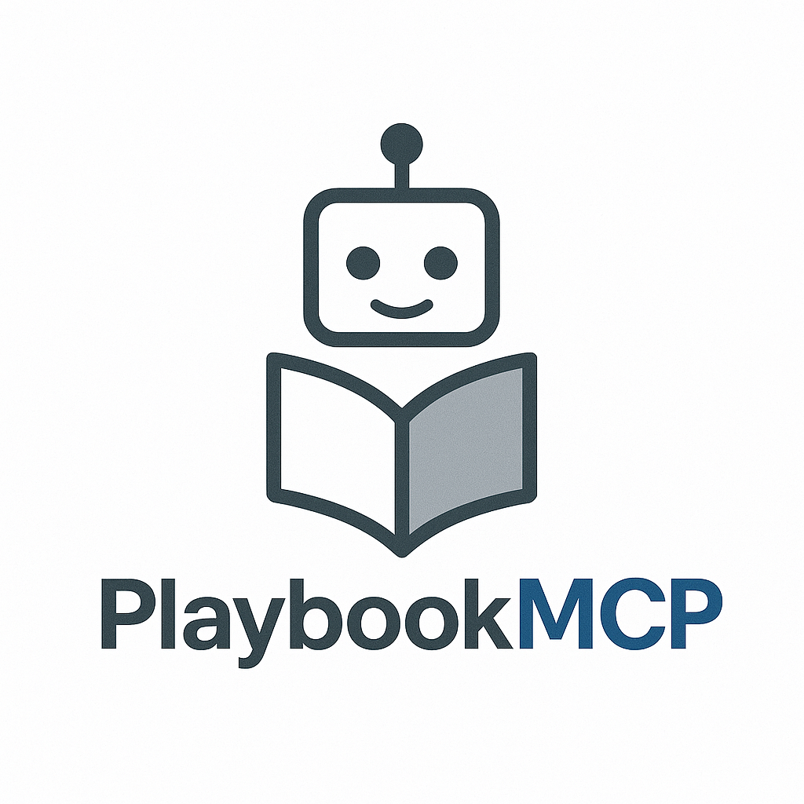
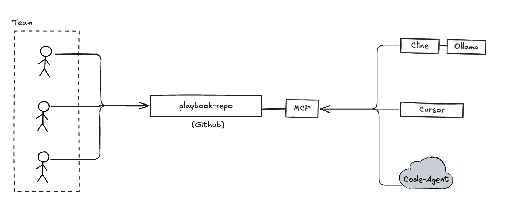
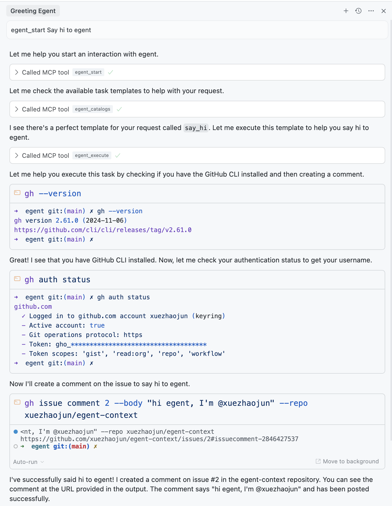

<div align="center">
  

  <p>A collaborative MCP server for sharing AI agent contexts between engineers</p>

  <!-- Add badges here -->

<a href="#"></a>
<a href="#"></a>

</div>

## 📋 Motivation & Overview

Modern programming tools like Cursor, Windsurf, Augment Code, and Cline all feature powerful "agent modes" that can automatically complete complex tasks based on natural language instructions:

- Building a full-stack feature with frontend, backend and database changes
- Refactoring code across multiple files following consistent patterns
- Setting up proper authentication flows with middleware and API endpoints
- Implementing complex algorithms with proper error handling and testing

However, these capabilities face a critical limitation: **context sharing**.

### The Problem

- Each team member uses different tools (Cursor, Cline, etc.)
- Natural language "task templates" exist only in individual environments
- No centralized way to share, version, or collaboratively improve these contexts
- Knowledge silos form as team members develop their own agent instructions

### The Solution: Egent

Egent converts GitHub repository-based contexts into an MCP Server that all mainstream programming tools support. This enables:

- **Collaborative editing** of agent contexts through standard GitHub workflows
- **Version control** for your team's AI prompts and task templates
- **Immediate sharing** of new capabilities across the entire team

For example, when engineer Alice adds a new task template for "Updating dependency versions across the monorepo," commits it to the context repo, and pushes, engineer Bob immediately gains access to this capability in his preferred coding tool.

## 🔍 Design

<div align="center">
  
</div>

Your team can continuously enrich the knowledge base by editing the context-repo (typically a GitHub repository), enabling AI to automatically complete various tasks.

For context repository structure details, see [docs/context.md](docs/context.md).

## 🚀 How to Use

### Setup

#### Basic Configuration

To use Egent with a remote context repository:

```json
{
  "mcpServers": {
    "egent": {
      "command": "npx",
      "args": ["-y", "egent@latest", "--context-repo", "<your context repo>"]
    }
  }
}
```

#### Local Development

For testing with a local context directory:

```json
{
  "mcpServers": {
    "egent-local": {
      "command": "npx",
      "args": [
        "-y",
        "egent@latest",
        "--context-path",
        "<your context files path>"
      ]
    }
  }
}
```

#### Egent Development

For developing Egent itself:

```json
{
  "mcpServers": {
    "egent-dev": {
      "command": "node",
      "args": ["build/index.js", "--context-path", "<your context files path>"]
    }
  }
}
```

You can also use `inspector` to inspect the MCP resources:

```bash
npx @modelcontextprotocol/inspector node build/index.js --context-repo git@github.com:stolostron/server-foundation-dev-context.git
```

### Chat with Your Code-Agent

Below is an example configuration in Cursor:

```json
{
  "mcpServers": {
    "egent": {
      "command": "npx",
      "args": [
        "-y",
        "egent@latest",
        "--context-repo",
        "git@github.com:xuezhaojun/egent-context.git"
      ]
    }
  }
}
```

The first command must be `egent_start` to initiate interaction:

```
egent_start Say Hi to Egent.
```

Or more specific:

```
use MCP tool egent_start Say hi to Egent.
```

Your code-agent will then add a comment on this [issue](https://github.com:xuezhaojun/egent-context/issues/2).

<div align="center">
  
</div>

For all tools supported by Egent, see the [MCP documentation](docs/mcp.md).

## 💡 Recommended Practices

- **Build a task library**: Create templates for common operations like setting up new components, implementing authentication flows, or generating test suites
- **Share team knowledge**: Document project-specific patterns and practices as context for the agents
- **Cross-tool compatibility**: Ensure all team members benefit regardless of their preferred coding tool
- **Iterative improvement**: Continuously refine task templates based on team feedback
