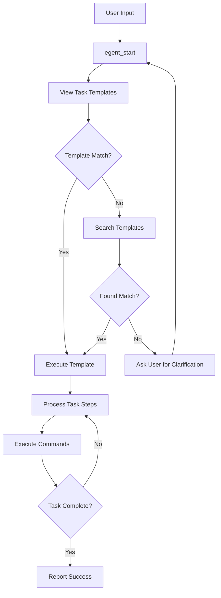

# MCP (Model Context Protocol) Documentation

## Overview

The MCP server implements a set of tools that enable interaction with the Egent context system. These tools facilitate task template discovery, execution, and searching capabilities.

## Available Tools

### 1. egent_start

- **Purpose**: Initiates a new task based on user input
- **Parameters**:
  - `user_task` (string): The task description from the user
- **Function**: Provides guidance on how to process the user's task request

### 2. egent_catalogs

- **Purpose**: Lists all available task templates
- **Parameters**: None
- **Function**: Returns a formatted list of task templates with their descriptions

### 3. egent_execute

- **Purpose**: Executes a specific task template
- **Parameters**:
  - `id` (string): The identifier of the task template to execute
- **Function**: Retrieves and returns detailed instructions and knowledge dependencies for the specified task

### 4. egent_search

- **Purpose**: Searches through task templates
- **Parameters**:
  - `query` (string): The search query to find relevant task templates
- **Function**: Performs semantic search across task templates to find relevant matches

## Agent Workflow After egent_start

## Implementation Details

The MCP server is initialized with the following components:

- Knowledge base loader
- Task template manager
- Context synchronization
- Tool registration system

The server supports both local context paths and remote Git repositories for context resources. It can be configured using environment variables or command-line arguments:

- `EGENT_CONTEXT_REPO`: URL of the Git repository containing context resources
- `EGENT_CONTEXT_REF`: Branch, tag, or commit hash in the context repository
- `EGENT_CONTEXT_PATH`: Path to a local directory containing context resources
